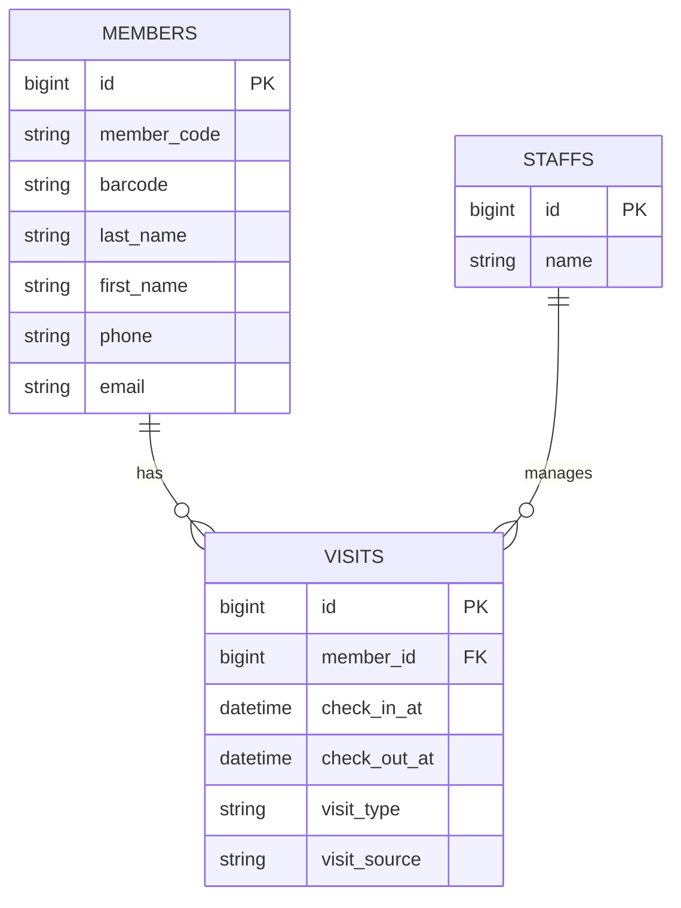
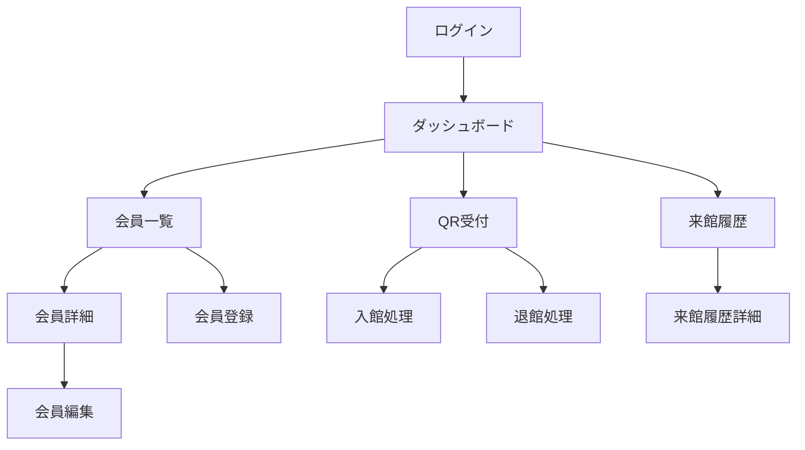

# クライミングジム向け入退館管理システム

## 概要

QRコードを利用した入退館管理システムです。

会員証のQRコードを読み取り、
入館・退館を簡単に記録できます。

---

## 開発背景

受付業務の効率化を目的として開発しました。

---

## 使用技術

- PHP 8
- Laravel 12
- MySQL
- Docker（Laravel Sail）
- Tailwind CSS
- html5-qrcode

---

## 主な機能

- ログイン機能
- 会員管理
- QRコード読取
- 入館処理
- 退館処理
- 来館履歴表示

---

## 工夫した点

- Serviceクラスによる責務分離
- QRコードによる高速受付
- 業務フローを意識した画面設計

---

## ER図

---

## 画面イメージ

